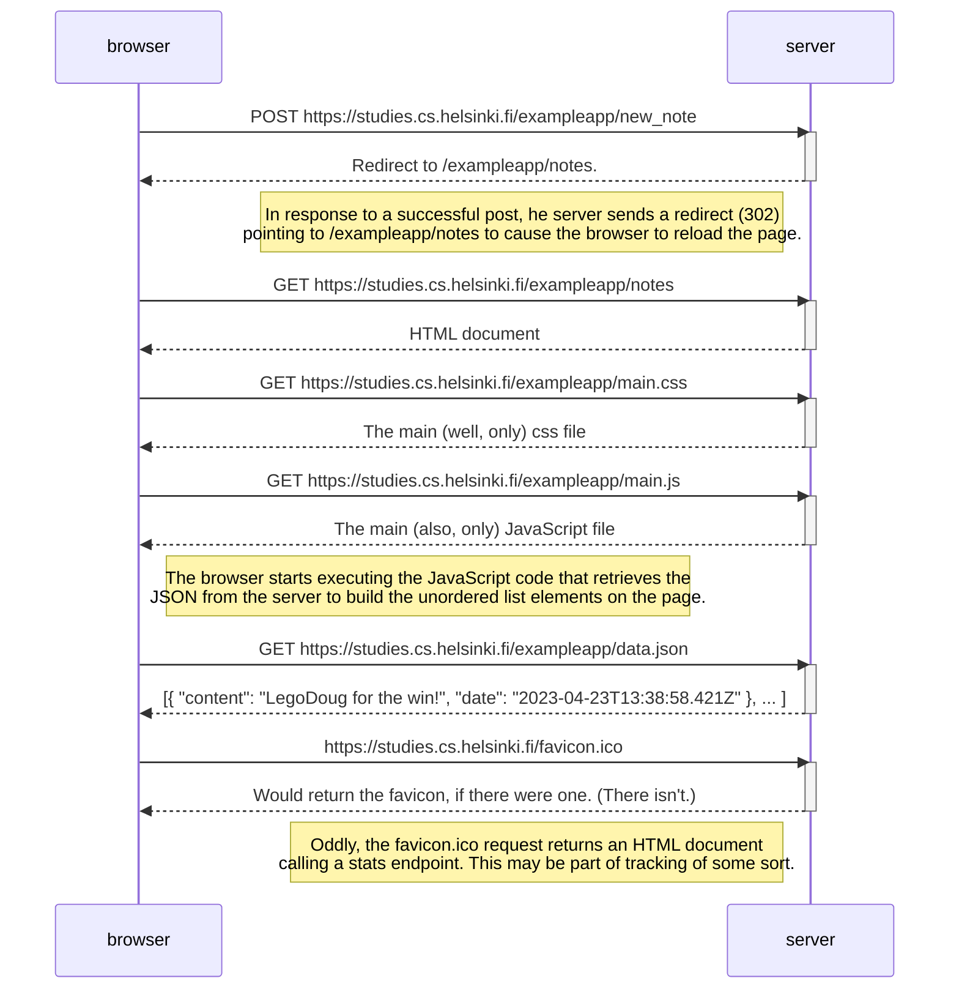

```mermaid
  sequenceDiagram
    participant browser
    participant server

    browser ->> server: POST https://studies.cs.helsinki.fi/exampleapp/new_note
    activate server
    server -->> browser: Redirect to /exampleapp/notes.
    deactivate server
    
    Note left of server: In response to a successful post, he server sends a redirect (302) <br>pointing to /exampleapp/notes to cause the browser to reload the page. 

    browser->>server: GET https://studies.cs.helsinki.fi/exampleapp/notes
    activate server
    server-->>browser: HTML document
    deactivate server

    browser->>server: GET https://studies.cs.helsinki.fi/exampleapp/main.css
    activate server
    server-->>browser: The main (well, only) css file
    deactivate server

    browser->>server: GET https://studies.cs.helsinki.fi/exampleapp/main.js
    activate server
    server-->>browser: The main (also, only) JavaScript file
    deactivate server

    Note right of browser: The browser starts executing the JavaScript code that retrieves the <br>JSON from the server to build the unordered list elements on the page.

    browser->>server: GET https://studies.cs.helsinki.fi/exampleapp/data.json
    activate server
    server-->>browser: [{ "content": "LegoDoug for the win!", "date": "2023-04-23T13:38:58.421Z" }, ... ]
    deactivate server

    browser ->> server: https://studies.cs.helsinki.fi/favicon.ico
    activate server
    server -->> browser: Would return the favicon, if there were one. (There isn't.) 
    deactivate server
    
    Note left of server: Oddly, the favicon.ico request returns an HTML document <br>calling a stats endpoint. This may be part of tracking of some sort.
```
