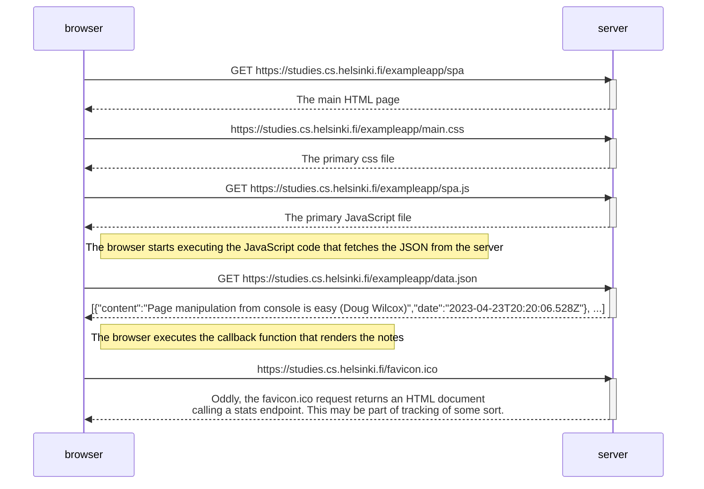

```mermaid
  sequenceDiagram
    participant browser
    participant server

    browser ->> server: GET https://studies.cs.helsinki.fi/exampleapp/spa
    activate server
    server -->> browser: The main HTML page
    deactivate server

    browser ->> server: https://studies.cs.helsinki.fi/exampleapp/main.css
    activate server
    server -->> browser: The primary css file
    deactivate server

    browser ->> server: GET https://studies.cs.helsinki.fi/exampleapp/spa.js
    activate server
    server -->> browser: The primary JavaScript file
    deactivate server

    Note right of browser: The browser starts executing the JavaScript code that fetches the JSON from the server

    browser ->> server: GET https://studies.cs.helsinki.fi/exampleapp/data.json
    activate server
    server -->> browser: [{"content":"Page manipulation from console is easy (Doug Wilcox)","date":"2023-04-23T20:20:06.528Z"}, ...]
    deactivate server

    Note right of browser: The browser executes the callback function that renders the notes
    
    browser ->> server: https://studies.cs.helsinki.fi/favicon.ico
    activate server
    server -->> browser: Oddly, the favicon.ico request returns an HTML document <br>calling a stats endpoint. This may be part of tracking of some sort.
    deactivate server

```
