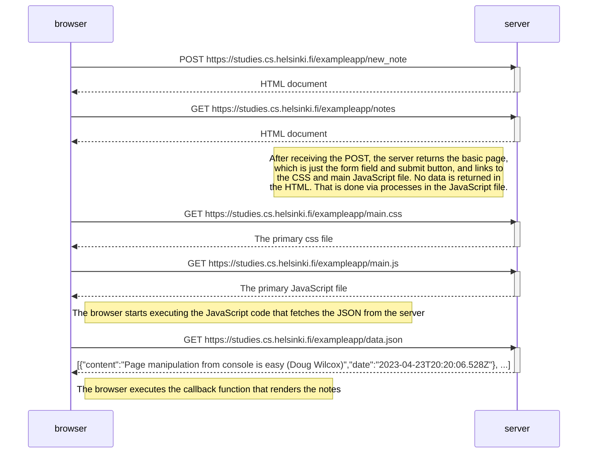

```mermaid
  sequenceDiagram
    participant browser
    participant server

    browser ->> server: POST https://studies.cs.helsinki.fi/exampleapp/new_note
    activate server
    server -->> browser: HTML document
    deactivate server

    browser ->> server: GET https://studies.cs.helsinki.fi/exampleapp/notes
    activate server
    server -->> browser: HTML document
    deactivate server

    Note left of server: After receiving the POST, the server returns the basic page,<br>which is just the form field and submit button, and links to <br>the CSS and main JavaScript file. No data is returned in <br>the HTML. That is done via processes in the JavaScript file.


    browser ->> server: GET https://studies.cs.helsinki.fi/exampleapp/main.css
    activate server
    server -->> browser: The primary css file
    deactivate server

    browser ->> server: GET https://studies.cs.helsinki.fi/exampleapp/main.js
    activate server
    server -->> browser: The primary JavaScript file
    deactivate server

    Note right of browser: The browser starts executing the JavaScript code that fetches the JSON from the server

    browser ->> server: GET https://studies.cs.helsinki.fi/exampleapp/data.json
    activate server
    server -->> browser: [{"content":"Page manipulation from console is easy (Doug Wilcox)","date":"2023-04-23T20:20:06.528Z"}, ...]
    deactivate server

    Note right of browser: The browser executes the callback function that renders the notes
```
