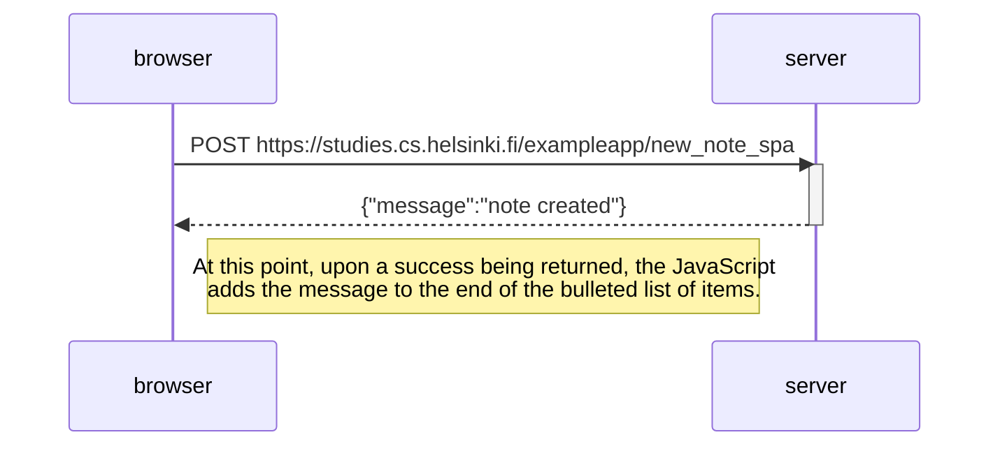

```mermaid
  sequenceDiagram
    participant browser
    participant server

    browser ->> server: POST https://studies.cs.helsinki.fi/exampleapp/new_note_spa
    activate server
    server -->> browser: {"message":"note created"}
    deactivate server

    Note right of browser: At this point, upon a success being returned, the JavaScript <br>adds the message to the end of the bulleted list of items.  
```
